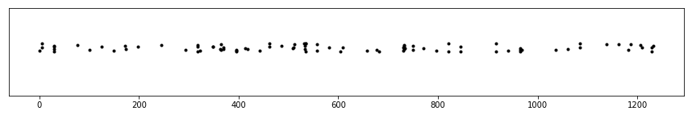
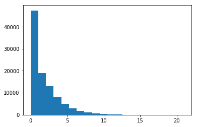

Example: Modeling Seismic Activity
==================================

One field where Hawkes processes have traditionally been popular is
seismology. In this example, we look at fitting a univariate Hawkes
model to earthquakes.

.. code-block:: python

    %matplotlib inline
    import requests
    from lxml import html
    from datetime import datetime as dt
    import numpy as np
    from matplotlib import pyplot as plt

Let's start by scraping some data on recent earthquakes in and around
Istanbul -- where this tutorial was written. The following short script
uses ``requests``, ``lxml`` and ``pandas`` to scrape some data from the
"recent earthquakes" report maintained by Bogazici University's
`Kandilli Observatory <http://www.koeri.boun.edu.tr>`__, and whip it
into shape for use.

.. code-block:: python

    res = requests.get("http://www.koeri.boun.edu.tr/scripts/lst9.asp")
    tx = html.fromstring(res.content).xpath("//pre/text()")[0]
    lines = tx.splitlines()[7:]  # get rid of the headers
    
    # take out timestamps and convert them to "hours since first event"
    timestamps = [dt.strptime(l[:19], "%Y.%m.%d %H:%M:%S") for l in lines if "ISTANBUL" in l]
    t = np.array([(x - ts[-1]).total_seconds() / 3600 for x in timestamps])[::-1]

Estimating Hawkes process parameters
------------------------------------

Hawkes processes model *self-excitement*, systems where point (or
*event*) occurrences excite, or increase the probability of occurrence
for, future points. Earthquakes fit this description. Indeed, they are
known to trigger *after-shocks*.

Plotting occurrence times on the timeline, one thing we can expect of
aftershock sequences is that they appear "clustered" in time. This is
intuitive, a "main" earthquake would occur stochastically (as it would
occur in a Poisson process), and the others in the cluster would follow
closely after. We plot our data below to verify that this appears to be
the case. (We add some "jitter" on the y axis to make viewing easier).

.. code-block:: python

    plt.figure(figsize=(15,2))
    plt.ylim([-5, 5])
    plt.yticks([])
    _ = plt.plot(t, np.random.rand(len(t)), 'k.')

We now move to fitting a (univariate) Hawkes process, using the
:class:`hawkeslib.UnivariateExpHawkesProcess` class. Before we move
on, let's recap the interpretation of the parameters.

-  ``mu`` is the background intensity rate, i.e. the intensity rate for
   the earthquakes that occur exogenously.
-  ``alpha`` is the infectivity factor. It can be interpreted as the
   number of aftershocks, in expectation, to be triggered by each
   earthquake.
-  ``theta`` is the *rate* parameter of the exponential delay *density*.
   For example, ``theta`` equaling to 0.5 would mean that on average 2
   hours pass between the main earthquake and the aftershock.

Let's fit the model.

.. code-block:: python

    %%time
    from hawkeslib import UnivariateExpHawkesProcess as UVHP
    
    uv = UVHP()
    uv.fit(t)
    print uv.get_params()

.. parsed-literal::

    (0.04930555306217892, 0.30548369162341404, 5.150339498582191)
    CPU times: user 1.48 ms, sys: 0 ns, total: 1.48 ms
    Wall time: 1.44 ms

Interpreting the parameters, we conclude that earthquakes occur
exogenously once every ~20 hours in Istanbul (here, we call any
registered seismic activity an "earthquake"). Each main shock results in
0.3 aftershocks on average, and aftershocks occur with
``1 / 5.15 = 0.194`` delay or 12 minutes on average.

Having fit a model, ``hawkeslib`` allows sampling (unconditional) from
the model, as well as evaluate likelihood (e.g. for out-of-sample cross
validation) for other data sets. Here, let's take a few samples from the
"earthquake timeline" and use it to approximate the histogram for the
number of tremors during a 24 hour time span in the city.

.. code-block:: python

    nr_shocks_sample = [len(uv.sample(24)) for x in range(100000)]
    _ = plt.hist(nr_shocks_sample, bins=20)

Bayesian inference
------------------

Having fit the model, we now move to quantifying uncertainty in the
parameter estimates. In ``hawkeslib``, we do this by Bayesian inference
in the univariate Hawkes model. Related functionality is implemented in
:class:`hawkeslib.BayesianUVExpHawkesProcess`.

Below, we use ``hawkeslib`` to sample from the posterior
distribution of parameters ``mu``, ``alpha``, and ``theta``. We then
present "Bayesian credible intervals" for the parameters.

.. code-block:: python

    from hawkeslib import BayesianUVExpHawkesProcess as BUVHP
    
    buv = BUVHP(mu_hyp=(1., 10.), alpha_hyp=(1., 1.), theta_hyp=(1., 10.))
    trace = buv.sample_posterior(t, T=t[-1], n_samp=50000)

.. code-block:: python

    # compute the BCIs
    print pm.stats.quantiles(trace["alpha"], [2.5, 97.5])
    print pm.stats.quantiles(trace["theta"], [2.5, 97.5])

.. parsed-literal::

    {2.5: 0.19881998542628126, 97.5: 0.45850986170997604}
    {2.5: 2.9138895786443646, 97.5: 8.605057427283178}

We observe that, under small data the credible intervals around our
parameters are relatively wide.

Let us end by noting that a more expressive model, one that takes into
account earthquake *magnitudes*, would be required for more realistic
scenarios. Traditionally, this is a *marked* Hawkes process that's known
as ETAS, the Epidemic-type Aftershock Sequence Model [1]_.

**References**

.. [1] Ogata, Yosihiko, Ritsuko S. Matsu'ura, and Koichi Katsura. "Fast likelihood
       computation of epidemic type aftershock‐sequence model." Geophysical research
       letters 20.19 (1993): 2143-2146.
