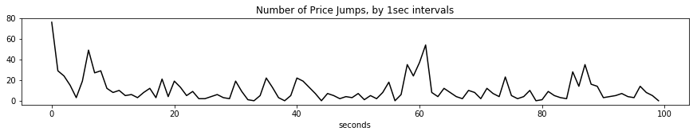
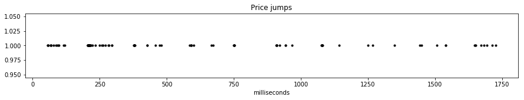
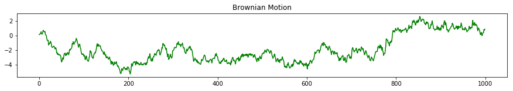
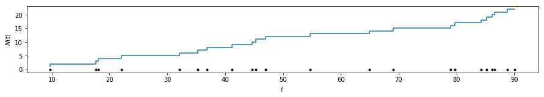
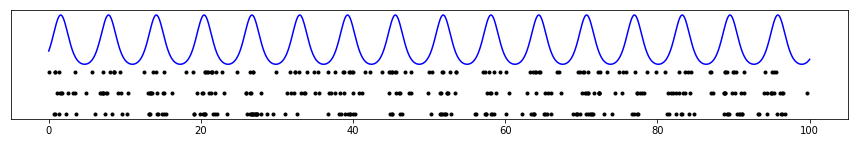
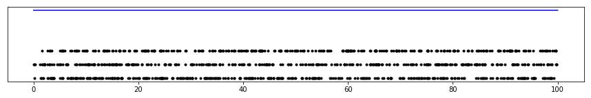
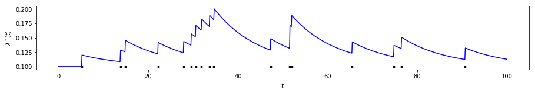

Tutorial: Hawkes Processes
==========================

Here we present an informal introduction to the ideas and theory
behind self-exciting (Hawkes) processes. We assume the reader has some
familiarity with statistics and machine learning. However, rather than
walking the reader through heavy math, we try to highlight the intuition
of Hawkes and its potential application areas.

Some Background
---------------

Many natural phenomena of interest, to machine learning as well as other
disciplines, include **time** as a central dimension of analysis. A key
task, then, is to capture and understand statistical relationships along
the timeline. "Workhorse" models addressing *temporal* data are
collected under *time-series analysis*. Such models often divide time
into equal-sized buckets, associate quantities with each such bucket on
which the models operate. This is the *discrete-time* formalism that
appears in many models familiar in machine learning such as
Kalman filters and hidden Markov models, as well as common models in
econometrics and forecasting such as ARIMA or exponential smoothing.

Say we are provided the timestamps of all "price jumps" in a financial
market. Exploring
this data set from a temporal standpoint, we often take the path of
"aggregating" statistics on a uniform time grid, and running models on
these aggregates. Concretely, take "millisecond" timestamps of financial
market price events:

.. code-block:: python

    %matplotlib inline
    import numpy as np
    import pandas as pd
    from matplotlib import pyplot as plt
    
    # here are the "timestamps"
    df = pd.read_csv("example_data_top4.csv", header=None)
    ar = np.array(df.loc[:, 1])
    
    print ar

.. parsed-literal::

    [     56      56      59 ... 8199797 8199798 8199984]

Below, we aggregate them to 1 second intervals --collecting the number of
"events" at each interval-- to arrive at a familiar
"time-series" plot.

.. code-block:: python

    # here is the "aggregated" time series plot
    bc = np.bincount(np.floor(ar / 1000.).astype(int))
    
    plt.figure(figsize=(15,2))
    plt.title("Number of Price Jumps, by 1sec intervals")
    plt.xlabel("seconds")
    _ = plt.plot(bc[:100], 'k-')

There are many reasons to prefer discrete-time models. First,
data may only be collected by a real-world observer (system) in uniform
grids of time -- and no more granular data is available. Then, of
course, more sophisticated models are of little use. Second, these
models might be just enough to explain temporal relationships.

However, many real-world data are available with timestamps. That is,
they correspond to discrete events in *continuous time*. The analyst's
job, then, is to better explain granular temporal relationships, and
answer questions like "when is the next *event* going to occur?", or
"how many events do we expect in the *next* 5 minutes?". By basing the
analysis on a formalism of continuous time (events can occur at any
time) and discrete events (occurrences are *instantaneous*) , the
answers to such questions are unlocked. Furthermore, the framing of the
analysis does not depend on arbitrary discretizations of data, that may
well lead to loss of valuable information.

Plotting the occurrences themselves, this is more intuitive. Each "point"
in the graph is a unique data point, and an arbitrary time "grid" would
lead to loss of information.

.. code-block:: python

    plt.figure(figsize=(15,2))
    plt.title("Price jumps")
    plt.xlabel("milliseconds")
    _ = plt.plot(ar[:100], np.ones(100), 'k.')

Temporal Point Processes
------------------------

For dealing with the data above, we will need a few definitions.
**Stochastic processes** are defined as (often *infinite*) collections
of random variables. We will also equip this collection with an *index
set*. For instance, formalizing a model for the "discrete-time" data
above, we could write :math:`\{X_t\}_{t=0}^\infty, t \in \mathbb{Z_+}`.
Here :math:`X_t` make up the collection while :math:`\mathbb{Z_+}` is
the *index set*. The specific dependence (or rather, independence)
structure, and other parametric assumptions of relationships among
:math:`\{X_t\}` determine the stochastic process. Note here that a *random
variate*, or a *realization* of the process is the entire trajectory
determined by values taken by all :math:`X_t` (often part of which we
observe).

Things are slightly more interesting when the index set is
:math:`\mathbb{R}`. Interpreting the index set as time again, we
have arrived at *continuous-time* processes.
Each realization from the process now completely
determines a *function* on domain :math:`\mathbb{R}`. In machine
learning, a **Gaussian process** is one such example. A staple of
quantitative finance, the **Wiener process** (Brownian motion) is another
example.

.. code-block:: python

    ar_bm = np.cumsum(np.random.randn(1000) * 0.5**2)
    plt.figure(figsize=(15,2))
    plt.title("Brownian Motion")
    _ = plt.plot(ar_bm, 'g-')

Drawing *realizations* from both Gaussian and Wiener processes (a
stylized example above), we end up with *functions*
:math:`f: \mathbb{R} \rightarrow \mathbb{R}`. For our purposes, of
modeling discrete events, let us restrict this family of possible
functions to a special class of step functions defined on
:math:`\mathbb{R}`. Namely, we will deal with functions
:math:`N: \mathbb{R_+} \rightarrow \mathbb{Z_+}`, which are step
functions such that :math:`s > t` implies :math:`N(s) \ge N(t)`. We call
such processes **counting processes**.

One possible counting process realization is presented below.
Intuitively, the name already suggests one interpretation close to what
we are looking for. We can simply take :math:`N(t)` to correspond to the
"number of occurrences" up to time :math:`t`. This also suggests that
with every counting process, we can associate a probability distribution
over *points* on a timeline. This correspondence is also represented in
the figure below. (A technical note here. In making this jump from
counting processes to points, we will assume hereforth that no two
points coincide, *almost surely*. In practice, this is rarely an issue.)

This is one way to define **temporal point processes**, a probability
distribution such that each draw is a collection of points on the real
line (often the "timeline"). Each "point" will correspond to an "event
occurrence" in our example above, and we will use these theoretical
devices to explore how "event occurrences" are dispersed throughout
time.

.. code-block:: python

    ar_pp = sorted(np.random.rand(np.random.poisson(20)) * 100)
    f = plt.figure(figsize=(15,2))
    
    plt.step(ar_pp, np.cumsum(np.ones_like(ar_pp)))
    plt.ylabel("$N(t)$")
    plt.xlabel('$t$')
    _ = plt.plot(ar_pp, np.zeros_like(ar_pp), 'k.')

Poisson Process
---------------

We start with the simplest temporal point process, the **Poisson
process**. Poisson processes have been described as the *simplest*
process, the process with *complete randomness* [1]_, or by
Robert Gallager as "the process for which everything we could wish to be
true, is true".

The Poisson process is characterized by complete independence. Other
than the point process being *simple* (no two points coincide), the
defining property of Poisson processes is as follows:

    The number of occurrences on *any two disjoint intervals* is
    **independent**

The following property is often given in the *definition* of Poisson
processes. Surprisingly, this property is in fact a consequence of the
property above (and some other more technical assumptions).

    The number of occurrences on an interval :math:`A` **follows the
    Poisson distribution**,

    .. math::  N(A) \sim \mathcal{Po}(\xi(A)) 

Here we have let :math:`N(A)` denote the number of points on the
interval A, which is itself a random variable of course.
:math:`\mathcal{Po}` denotes the Poisson distribution. :math:`\xi` is a
bit more tricky. It is a *measure* on :math:`\mathbb{R}`, such that it
takes nonnegative values, satisfies :math:`\xi(\emptyset) = 0`, and the
sum of measures of disjoint sets is equal to the measure of the union of
such sets. For our purposes, however, let us take

.. math::

   \xi(A) = \int_A dt \lambda(t),

where

.. math::

   \begin{align}
   \lambda(t) &= \lim_{\Delta t \downarrow 0} \Delta t^{-1} \mathbb{E} N(t, t + \Delta t) \\
              &= \lim_{\Delta t \downarrow 0} \Delta t^{-1} \mathbb{P} \{N(t, t + \Delta t) > 0\} . 
   \end{align}

We define the function :math:`\lambda`, the **intensity function**. For
those familiar with probability theory, it should resemble
the *density* function. One way to think about it is that
:math:`\lambda(t)` defines (in the limit) the probability that there is
an occurrence in the infinitesimal interval after time :math:`t`. So the
higher :math:`\lambda(t)`, the higher the probability of observing
points in and around :math:`t` (assuming :math:`\lambda(t)` is smooth
and nice). Let us finally note that the equality above is possible due
to our assumption of simplicity -- no two points can land on this
infinitesimal interval.

Let's take a step back and recap.

- We define a Poisson process with a function :math:`\lambda(t) > 0, \forall t`.
- Say we have two intervals, :math:`A, B \subset \mathbb{R}`. The number of occurrences in these
  intervals will be Poisson distributed with :math:`N(A) \sim \int_A \lambda(t)dt`, and
  :math:`N(B) \sim \int_B \lambda(t)dt`.
- Most importantly, :math:`N(A), N(B)` are independent variables for all :math:`A \cap B = \emptyset`.
- Higher intensity functions :math:`\lambda(t)`, as expected, are associated with higher
  probabilities of event occurrences.

As a concrete example, take the following draws from a Poisson process
with :math:`\lambda(t) = \exp(\sin t))`

.. code-block:: python

    a = np.linspace(0, 100, 10000)
    lt = np.exp(np.sin(a))
    
    plt.figure(figsize=(15, 2))
    plt.plot(a, lt, 'b-')
    plt.yticks([])
    
    for k in range(3):
        count = np.random.poisson(3 * 100)
        smp = [x for x in sorted(np.random.rand(count) * 100) if np.random.rand() * 3 < np.exp(np.sin(x))]
        plt.plot(smp, np.ones_like(smp) * -1 * k, 'k.')

Above, the blue line represents the intensity function
:math:`\lambda(t)`, while each row of black dots is a draw from the
Poisson process. Note how the dots have a higher tendency to appear near
"peaks" of the intensity function.

That being said, however, the appearance of dots is completely
independent. Informally, given :math:`\lambda(t)`, each event occurs
independently and is not affected by whether there are other events in
its vicinity.

An important special case of the Poisson process is when the intensity
function is constant, i.e. :math:`\lambda(t) = \mu`. We call this
special case a **homogeneous** Poisson process, and it is further
characterized by *stationarity*. Informally, the probability that a
point occurs in the vicinity of :math:`t` is constant, making it equally
likely for points to appear anywhere along the timeline. Concretely,
samples from this process would look like (for :math:`\lambda(t) = 3)`:

.. code-block:: python

    a = np.linspace(0, 100, 10000)
    lt = np.ones_like(a) * 3
    
    plt.figure(figsize=(15, 2))
    plt.plot(a, lt, 'b-')
    plt.yticks([])
    
    for k in range(3):
        count = np.random.poisson(3 * 100)
        smp = np.random.rand(count) * 100
        plt.plot(smp, np.ones_like(smp) * -1 * k, 'k.')

We implement homogeneous Poisson processs in
:class:`hawkeslib.PoissonProcess`.

Poisson processes underlie many applications, for example in queueing theory.
There, however, people or packets arriving in a queue can reasonably be expected
to obey independence.
In many other applications, however, the independence
assumption fails basic intuition about the domain. For instance,
major financial events are known to draw (excite) others like them.
Earthquakes not only occur stochastically themselves, but stochastically
trigger others.
In these domains, we understand, that Poisson processes
lead to an oversimplification. We must work with a more expressive class of
models.

Self-exciting Processes
-----------------------

Until now we used the real line on which we defined our point process
only rather casually to represent time.
The same set :math:`\mathbb{R}` can be used to represent distance on a
fault line, or depth for example; when carrying out a "cross-sectional"
analysis of earthquakes.
Here, we will start assigning some meaning to time.

We are looking for ways to break the independence assumption and somehow
let event occurrences depend on others.
A very natural way to do this is to let the "future" (the rest of the real line deemed not observed)
depend on the past.
Concretely, on :math:`\mathbb{R}`, we will let :math:`\lambda(t)`
depend on the occurrences in :math:`[0, t)`.

In Poisson processes, the intensity function :math:`\lambda(t)` was deterministic.
Here, let us introduce :math:`\lambda^*(t)`, the *conditional intensity* function.
:math:`\lambda^*(t)` determines the probability of a point occuring in the infinitesimal interval after :math:`t`,
*given* the events that have *occurred* until :math:`t` (the asterisk will serve as a reminder of this conditioning).
In reality, :math:`\lambda^*(t)` is a function of :math:`t`, as well as the occurrences :math:`\{t_i | t_i < t\}`.

Let's not get into details here, but it is a fundamental result in the
general theory of temporal point processes [1]_ that we can take
:math:`\lambda^*(t)`, and under a
set of mild conditions this will lead to a well-defined point process.
Furthermore, such a characterization will enable simplified calculations
of likelihood and will be interpretable. See [1]_ chap. 7 for
further details.

Processes defined as above have been called *evolutionary*,
**self-modulating**, or *conditional intensity* point processes [1]_, [2]_.
In cases where a point occurrence only *increases* future :math:`\lambda^*(t)`, another term
is more appropriate: **self-exciting**.

Hawkes Processes
----------------

Hawkes processes [3]_ are often the first and most popular
example to evolutionary processes. The (univariate) Hawkes process is
defined by the conditional intensity function

.. math::

   \lambda^*(t) = \mu + \sum_{t_i < t} \varphi(t - t_i).

Let's take a minute to break this equation down. At any moment
:math:`t`, the conditional intensity function is at least
:math:`\mu > 0`, the *background intensity*. However, it also depends
*linearly* on effects of events that have occurred before
time :math:`t`. Namely, this dependence is through a *triggering kernel*
function :math:`\varphi(.)`, a function of the *delay* :math:`t - t_i`
between the current time and the timestamp of the previous event. Note
that :math:`\varphi` is nonnegative
(:math:`\varphi(x) \ge 0, \forall x \ge 0` and *causal*
:math:`\varphi(x) = 0, \forall x < 0`. It is usually a monotonically
decreasing function (such as exponential decay, or power-law decay).

Thinking the other way around, the function can be interpreted as
follows. Each event that occurs stochastically at a time :math:`t_i`
adds additional intensity to the process. This added effect often
*decays* throughout time (as governed by :math:`\varphi`). In other
words, every new occurrence *excites* the process, hence
*self-exciting*.

The most commonly used kernel function is an exponential decay
:math:`\varphi(x) = \alpha \beta \exp (-\beta x)`. Note that this
factorized form, with :math:`\int \beta \exp (-\beta x) = 1`, leads to a
convenient interpretation. :math:`\alpha > 0` is known as the
*infectivity factor*, and defines the *average* number of new
occurrences excited by any given occurrence.
:math:`\beta \exp (-\beta x)`, on the other hand is simply the
exponential density function that governs the probability distribution
of *delays* between events that excite each other. This is why it is
also called the delay *density*.

Below is a graphical representation of :math:`\lambda^*(t)`. Observe how
the intensity is *stochastically* excited by each new arriving
occurrence.

.. code-block:: python

    from hawkeslib import UnivariateExpHawkesProcess
    
    mu, alpha, beta = .1, .2, .1
    uv = UnivariateExpHawkesProcess()
    uv.set_params(mu, alpha, beta)
    smp = uv.sample(100)
    
    lda_ar = [mu + np.sum(alpha * beta * np.exp(-beta * (x - smp[smp < x]))) \
              for x in np.arange(0, 100, .1)]
    
    plt.figure(figsize=(15,2))
    plt.ylabel("$\lambda^*(t)$")
    plt.xlabel("$t$")
    plt.plot(smp, np.ones_like(smp) * .1, 'k.')
    _ = plt.plot(np.arange(0, 100, .1), lda_ar, 'b-')

So far, we discussed "univariate" Hawkes processes. We could assume,
however, that each event occurrence bears a discrete *mark* or label
from a finite set. Concretely, going back to our financial example,
event occurrences can belong to different types or assets. In this case,
one could view the system not only as a single stochastic process, but a
finite array of interacting, or *mutually-exciting* temporal point
processes.

Assume observed data is now available as a set of ordered pairs
:math:`\{(t_i, c_i)\}` where :math:`t_i \in \mathbb{R_+}` are the
timestamps, and :math:`c_i \in \{0, 1, \dots, K\}` are identifiers for
which process a given occurrence belongs to. We formalize a
**multivariate Hawkes process** using set of conditional intensity
functions

.. math::

   \lambda^*_k(t) = \mu_k + \sum_l \sum_{t_j < t, c_j \in l} \varphi_{l, k} (t - t_j).

where :math:`l, k \in \{0, 1, \dots, K\}` Intuitively, now each process is
not only *self-excitatory* but also
excited by events from other processes. Once again, it is common to take
a factorized kernel of the form

.. math::

   \varphi_{l, k}(x) = A_{l, k} \theta \exp(-\theta x),

where now :math:`A` is interpreted as the *infectivity matrix*, and
:math:`A_{l, k}` is interpretable as the expected number of further
type-\ :math:`k` events that will be caused by events of type :math:`l`.

Likelihood computation, parameter estimation and inference problems in
the backdrop of Hawkes processes are not trivial, but they are beyond the scope
of this short introduction.
See [4]_, [5]_ for extensive surveys with a more rigorous treatment of
Hawkes processes.
Most implementations in this library, and their corresponding API documentation refer
to the standard terminology set out in these works.

**References**

.. [1] Daley, D. J., and D. Vere-Jones. "An Introduction to the Theory of Point Processes:
   Volume I: Elementary Theory and Methods."
.. [2] Cox, David Roxbee, and Valerie Isham. Point processes. Vol. 12. CRC Press, 1980.
.. [3] Hawkes, Alan G. "Point spectra of some mutually exciting point processes." Journal of the Royal
   Statistical Society. Series B (Methodological) (1971): 438-443.
.. [4] Bacry, Emmanuel, Iacopo Mastromatteo, and Jean-François Muzy. "Hawkes processes in finance."
   Market Microstructure and Liquidity 1.01 (2015): 1550005.
.. [5] Laub, Patrick J., Thomas Taimre, and Philip K. Pollett. "Hawkes processes." arXiv preprint
   arXiv:1507.02822 (2015).